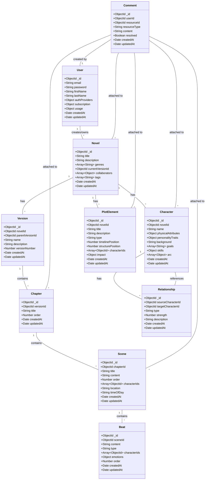

# Novylist Database Schema Architecture

**Title**: Novylist Database Schema Architecture  
**Description**: Comprehensive documentation of the MongoDB database schema used in Novylist  
**Last Updated**: 4/15/2025  

This document describes the database schema architecture for Novylist, detailing the MongoDB schema design, relationships between models, and design decisions.

## Overview

Novylist uses MongoDB as its primary database, leveraging its document-based structure to model the hierarchical nature of novels and related narrative elements. The schema has been designed to support:

1. **Hierarchical Content Structure**: Novels, chapters, scenes, and beats
2. **Narrative Management**: Characters, relationships, and plot elements
3. **Version Control**: Timeline-based version history with branching
4. **Collaboration**: User roles and permissions
5. **AI Integration**: Fields specifically designed for AI-assisted features

## Database Models

The system includes the following core models:



## Model Descriptions

### User Model

The User model stores authentication information, subscription details, and usage statistics.

```javascript
// Key fields
{
  email: { type: String, required: true, unique: true },
  password: { type: String, required: true },
  firstName: { type: String },
  lastName: { type: String },
  authProviders: {
    google: { id: String, token: String },
    linkedin: { id: String, token: String }
  },
  mfaEnabled: { type: Boolean, default: false },
  mfaMethod: { type: String, enum: ['app', 'email', 'sms'] },
  mfaSecret: { type: String },
  subscription: {
    tier: { type: String, enum: ['free', 'standard', 'premium'], default: 'free' },
    startDate: { type: Date },
    endDate: { type: Date },
    status: { type: String, enum: ['active', 'inactive', 'canceled'] }
  },
  usage: {
    aiRequests: {
      daily: { count: Number, lastReset: Date },
      monthly: { tokensUsed: Number, lastReset: Date }
    },
    features: {
      writingContinuation: { count: Number, tokensUsed: Number },
      characterDevelopment: { count: Number, tokensUsed: Number },
      plotAnalysis: { count: Number, tokensUsed: Number },
      dialogueEnhancement: { count: Number, tokensUsed: Number }
    }
  },
  createdAt: { type: Date, default: Date.now },
  updatedAt: { type: Date, default: Date.now }
}
```

### Novel Model

The Novel model is the top-level container for a writing project, with references to versions, characters, and plot elements.

```javascript
// Key fields
{
  title: { type: String, required: true },
  description: { type: String },
  genres: [{ type: String }],
  currentVersionId: { type: mongoose.Schema.Types.ObjectId, ref: 'Version' },
  collaborators: [
    {
      userId: { type: mongoose.Schema.Types.ObjectId, ref: 'User' },
      role: { type: String, enum: ['owner', 'editor', 'viewer'] },
      permissions: {
        edit: { type: Boolean, default: false },
        comment: { type: Boolean, default: true },
        share: { type: Boolean, default: false }
      }
    }
  ],
  tags: [{ type: String }],
  settings: {
    language: { type: String, default: 'en' },
    aiAssistanceLevel: { type: String, enum: ['minimal', 'balanced', 'extensive'], default: 'balanced' }
  },
  createdAt: { type: Date, default: Date.now },
  updatedAt: { type: Date, default: Date.now }
}
```

### Version Model

The Version model supports version control with parent-child relationships for branching.

```javascript
// Key fields
{
  novelId: { type: mongoose.Schema.Types.ObjectId, ref: 'Novel', required: true },
  parentVersionId: { type: mongoose.Schema.Types.ObjectId, ref: 'Version' },
  name: { type: String, required: true },
  description: { type: String },
  versionNumber: { type: Number, required: true },
  branchName: { type: String },
  isMajorVersion: { type: Boolean, default: false },
  createdAt: { type: Date, default: Date.now },
  updatedAt: { type: Date, default: Date.now }
}
```

### Chapter Model

The Chapter model organizes scenes within a version.

```javascript
// Key fields
{
  versionId: { type: mongoose.Schema.Types.ObjectId, ref: 'Version', required: true },
  title: { type: String, required: true },
  order: { type: Number, required: true },
  summary: { type: String },
  status: { type: String, enum: ['outline', 'draft', 'revision', 'complete'], default: 'draft' },
  createdAt: { type: Date, default: Date.now },
  updatedAt: { type: Date, default: Date.now }
}
```

### Scene Model

The Scene model contains the actual writing content, organized into chapters.

```javascript
// Key fields
{
  chapterId: { type: mongoose.Schema.Types.ObjectId, ref: 'Chapter', required: true },
  title: { type: String },
  content: { type: String },
  order: { type: Number, required: true },
  characterIds: [{ type: mongoose.Schema.Types.ObjectId, ref: 'Character' }],
  location: { type: String },
  timeOfDay: { type: String },
  weather: { type: String },
  status: { type: String, enum: ['outline', 'draft', 'revision', 'complete'], default: 'draft' },
  pov: { type: mongoose.Schema.Types.ObjectId, ref: 'Character' },
  createdAt: { type: Date, default: Date.now },
  updatedAt: { type: Date, default: Date.now }
}
```

### Beat Model

The Beat model represents the smallest narrative unit, containing specific moments within scenes.

```javascript
// Key fields
{
  sceneId: { type: mongoose.Schema.Types.ObjectId, ref: 'Scene', required: true },
  content: { type: String },
  type: { type: String, enum: ['action', 'dialogue', 'description', 'thought', 'emotion'] },
  characterIds: [{ type: mongoose.Schema.Types.ObjectId, ref: 'Character' }],
  emotions: {
    type: { type: String },
    intensity: { type: Number, min: 1, max: 10 }
  },
  order: { type: Number, required: true },
  aiSuggestions: [{
    type: { type: String },
    content: { type: String },
    applied: { type: Boolean, default: false }
  }],
  createdAt: { type: Date, default: Date.now },
  updatedAt: { type: Date, default: Date.now }
}
```

### Character Model

The Character model stores character information with physical attributes, personality traits, and development arcs.

```javascript
// Key fields
{
  novelId: { type: mongoose.Schema.Types.ObjectId, ref: 'Novel', required: true },
  name: { type: String, required: true },
  physicalAttributes: {
    age: { type: Number },
    gender: { type: String },
    height: { type: String },
    build: { type: String },
    hairColor: { type: String },
    eyeColor: { type: String },
    distinguishingFeatures: { type: String }
  },
  personalityTraits: [{
    trait: { type: String },
    strength: { type: Number, min: 1, max: 10 }
  }],
  background: { type: String },
  goals: [{ type: String }],
  skills: [{
    name: { type: String },
    level: { type: Number, min: 1, max: 10 }
  }],
  arc: [{
    phase: { type: String },
    description: { type: String },
    plotElementId: { type: mongoose.Schema.Types.ObjectId, ref: 'PlotElement' }
  }],
  aiSuggestions: [{
    type: { type: String, enum: ['background', 'personality', 'dialogue', 'conflict'] },
    content: { type: String },
    applied: { type: Boolean, default: false }
  }],
  createdAt: { type: Date, default: Date.now },
  updatedAt: { type: Date, default: Date.now }
}
```

### Relationship Model

The Relationship model defines connections between characters.

```javascript
// Key fields
{
  sourceCharacterId: { type: mongoose.Schema.Types.ObjectId, ref: 'Character', required: true },
  targetCharacterId: { type: mongoose.Schema.Types.ObjectId, ref: 'Character', required: true },
  type: { type: String, enum: ['family', 'friend', 'enemy', 'romantic', 'professional', 'mentor', 'other'] },
  strength: { type: Number, min: -10, max: 10 },
  description: { type: String },
  changes: [{
    description: { type: String },
    plotElementId: { type: mongoose.Schema.Types.ObjectId, ref: 'PlotElement' }
  }],
  createdAt: { type: Date, default: Date.now },
  updatedAt: { type: Date, default: Date.now }
}
```

### PlotElement Model

The PlotElement model tracks narrative structure elements, including timeline position and character impact.

```javascript
// Key fields
{
  novelId: { type: mongoose.Schema.Types.ObjectId, ref: 'Novel', required: true },
  title: { type: String, required: true },
  description: { type: String },
  type: { type: String, enum: ['event', 'revelation', 'decision', 'obstacle', 'resolution', 'turning_point'] },
  timelinePosition: { type: Number },
  structurePosition: { type: Number },
  characterIds: [{ type: mongoose.Schema.Types.ObjectId, ref: 'Character' }],
  impact: {
    description: { type: String },
    magnitude: { type: Number, min: 1, max: 10 }
  },
  aiSuggestions: [{
    type: { type: String, enum: ['consequence', 'alternative', 'enhancement'] },
    content: { type: String },
    applied: { type: Boolean, default: false }
  }],
  createdAt: { type: Date, default: Date.now },
  updatedAt: { type: Date, default: Date.now }
}
```

### Comment Model

The Comment model supports feedback with polymorphic references to different resource types.

```javascript
// Key fields
{
  userId: { type: mongoose.Schema.Types.ObjectId, ref: 'User', required: true },
  resourceId: { type: mongoose.Schema.Types.ObjectId, required: true },
  resourceType: { type: String, enum: ['novel', 'chapter', 'scene', 'character', 'plotElement'], required: true },
  content: { type: String, required: true },
  resolved: { type: Boolean, default: false },
  replies: [{
    userId: { type: mongoose.Schema.Types.ObjectId, ref: 'User' },
    content: { type: String },
    createdAt: { type: Date, default: Date.now }
  }],
  createdAt: { type: Date, default: Date.now },
  updatedAt: { type: Date, default: Date.now }
}
```

## Indexing Strategy

Proper indexing is crucial for query performance. The following indexes have been implemented:

### User Collection
```javascript
// Email for login and lookup
{ email: 1 }, { unique: true }
```

### Novel Collection
```javascript
// Collaborative access queries
{ 'collaborators.userId': 1 }
// Search and filtering
{ title: 'text', description: 'text' }
```

### Version Collection
```javascript
// Novel versions
{ novelId: 1 }
// Version hierarchy
{ parentVersionId: 1 }
```

### Chapter Collection
```javascript
// Version chapters
{ versionId: 1 }
// Order within version
{ versionId: 1, order: 1 }
```

### Scene Collection
```javascript
// Chapter scenes
{ chapterId: 1 }
// Order within chapter
{ chapterId: 1, order: 1 }
// Character appearances
{ characterIds: 1 }
```

### Beat Collection
```javascript
// Scene beats
{ sceneId: 1 }
// Order within scene
{ sceneId: 1, order: 1 }
// Character appearances in beats
{ characterIds: 1 }
```

### Character Collection
```javascript
// Novel characters
{ novelId: 1 }
// Character search
{ novelId: 1, name: 'text' }
```

### Relationship Collection
```javascript
// Character relationships
{ sourceCharacterId: 1 }
{ targetCharacterId: 1 }
```

### PlotElement Collection
```javascript
// Novel plot elements
{ novelId: 1 }
// Timeline order
{ novelId: 1, timelinePosition: 1 }
// Structure position
{ novelId: 1, structurePosition: 1 }
// Character involvement
{ characterIds: 1 }
```

### Comment Collection
```javascript
// Resource comments (polymorphic)
{ resourceId: 1, resourceType: 1 }
// User comments
{ userId: 1 }
```

## Data Relationships

### Reference vs. Embedding

The schema primarily uses references instead of embedding for most relationships:

1. **References (used for)**:
   - One-to-many relationships (Novel → Chapters)
   - Many-to-many relationships (Scenes ↔ Characters)
   - Relationships where the referenced documents are frequently accessed independently
   - Large documents that would exceed MongoDB's 16MB document size limit if embedded

2. **Embedding (used for)**:
   - Small, tightly coupled subdocuments (character physical attributes)
   - Comments replies
   - Data that is always accessed and updated together with its parent
   - Metadata and configuration settings

### Hierarchical Structure

The content follows a clear hierarchical structure:

```
Novel → Version → Chapter → Scene → Beat
```

This structure enables:
- Version control through branching at the Version level
- Organization of content at multiple levels
- Granular access to narrative components
- Progressive loading of content for performance

### Character and Plot Integration

Characters and plot elements are connected to the narrative through references:
- Scenes reference the characters present in them
- Beats reference the characters involved
- Plot elements reference affected characters
- Character arcs reference the plot elements that trigger changes

### AI Integration Points

Several models contain specific fields for AI integration:
- `aiSuggestions` arrays in Character, PlotElement, and Beat models
- Usage tracking in the User model
- AI assistance settings in the Novel model

## Virtuals and Middleware

### Virtual Properties

Virtual properties are used for computed fields:

```javascript
// Example: Character full name virtual
Character.virtual('fullName').get(function() {
  return `${this.name.first} ${this.name.last}`;
});

// Example: Scene word count virtual
Scene.virtual('wordCount').get(function() {
  return this.content ? this.content.split(/\s+/).length : 0;
});
```

### Middleware

Pre-save middleware is used for:
- Updating timestamps
- Handling password hashing (User model)
- Validating order values
- Maintaining version numbers

```javascript
// Example: Update timestamps on save
schema.pre('save', function(next) {
  this.updatedAt = new Date();
  next();
});

// Example: Hash password before saving
UserSchema.pre('save', async function(next) {
  if (this.isModified('password')) {
    this.password = await bcrypt.hash(this.password, 10);
  }
  next();
});
```

## Design Decisions

### NoSQL Approach

MongoDB was chosen over a relational database for several reasons:
1. **Document Structure**: Matches the hierarchical nature of narrative content
2. **Schema Flexibility**: Allows for evolving data requirements as the application develops
3. **Performance**: Optimized for read-heavy workloads typical in content consumption
4. **Scalability**: Horizontal scaling capabilities for growth

### Version Control Implementation

The version control system implements a Git-like branching model:
- Each Version has a parentVersionId, creating a tree structure
- The Novel.currentVersionId points to the active version
- Branches are created by making a new Version with a specified parent
- Merging is handled through application logic, not at the database level

### Polymorphic References

The Comment model uses polymorphic references to attach comments to different entity types:
- `resourceId` stores the ObjectId of the referenced document
- `resourceType` stores the type of resource being referenced
- This approach allows for flexible commenting on various elements without separate collections

### AI Field Integration

AI integration fields follow these principles:
1. **Suggestion Arrays**: Each entity that can receive AI assistance has an `aiSuggestions` array
2. **Applied Flag**: Tracks whether a suggestion has been used
3. **Type Categorization**: Classifies suggestions by purpose
4. **Minimal Storage**: Stores only essential information, not full prompt/response history

## Query Patterns

### Common Query Patterns

1. **Retrieving a novel with its current version**:
```javascript
const novel = await Novel.findById(novelId).populate('currentVersionId');
```

2. **Getting chapters for a version in order**:
```javascript
const chapters = await Chapter.find({ versionId }).sort({ order: 1 });
```

3. **Finding scenes with a specific character**:
```javascript
const scenes = await Scene.find({ characterIds: characterId });
```

4. **Getting a character with their relationships**:
```javascript
const character = await Character.findById(characterId);
const relationships = await Relationship.find({ 
  $or: [{ sourceCharacterId: characterId }, { targetCharacterId: characterId }] 
}).populate('sourceCharacterId targetCharacterId');
```

5. **Finding comments for a resource**:
```javascript
const comments = await Comment.find({ 
  resourceId, 
  resourceType 
}).populate('userId');
```

### Aggregation Examples

1. **Character appearance statistics**:
```javascript
const appearances = await Scene.aggregate([
  { $match: { versionId: ObjectId(versionId) } },
  { $unwind: '$characterIds' },
  { $group: { _id: '$characterIds', count: { $sum: 1 } } },
  { $sort: { count: -1 } }
]);
```

2. **Scene word count by chapter**:
```javascript
const wordCounts = await Scene.aggregate([
  { $match: { versionId: ObjectId(versionId) } },
  { $project: { 
      chapterId: 1, 
      wordCount: { $size: { $split: ['$content', ' '] } } 
  }},
  { $group: { 
      _id: '$chapterId', 
      totalWords: { $sum: '$wordCount' } 
  }}
]);
```

## Migration Strategy

The database schema supports future migrations through:
1. **Schema Versioning**: Schema version field on each collection
2. **Backward Compatibility**: New fields added with default values
3. **Feature Flags**: Controlling access to features that require new schema elements

For major schema changes:
1. Create a new collection with the updated schema
2. Implement a migration script to move data
3. Switch to the new collection once migration is complete
4. Archive the old collection for fallback purposes

## Performance Considerations

### Read/Write Optimization

The schema is optimized for read-heavy operations:
- Indexes on frequently queried fields
- Denormalization of commonly accessed data
- Strategic use of embedding vs. references

### Large Dataset Handling

For novels with extensive content:
1. **Pagination**: Implemented at the API level for large result sets
2. **Progressive Loading**: Loading content hierarchically (chapter → scenes)
3. **Projection**: Limiting fields returned based on view requirements
4. **Compound Indexes**: For complex filtering operations

## Security Considerations

1. **Access Control**: Permissions managed at the Novel level through collaborator roles
2. **Data Validation**: Schema validation ensures data integrity
3. **Sanitization**: Input sanitization implemented at the API level
4. **Audit Trails**: Timestamps and version history provide change tracking
5. **Encryption**: Sensitive data (passwords, auth tokens) stored with encryption

## Conclusion

The Novylist database schema architecture is designed to support the complex needs of a novel-writing platform while providing flexibility for future growth. The document-based approach with MongoDB aligns well with the hierarchical nature of narrative content and supports the collaborative, version-controlled environment needed for effective writing.

The schema incorporates specific elements for AI integration, allowing seamless connection between the narrative content and AI-assisted features while maintaining clean separation of concerns.

Future enhancements will focus on performance optimization for very large novels, enhanced analytics capabilities, and expanded AI integration fields as those features evolve.
