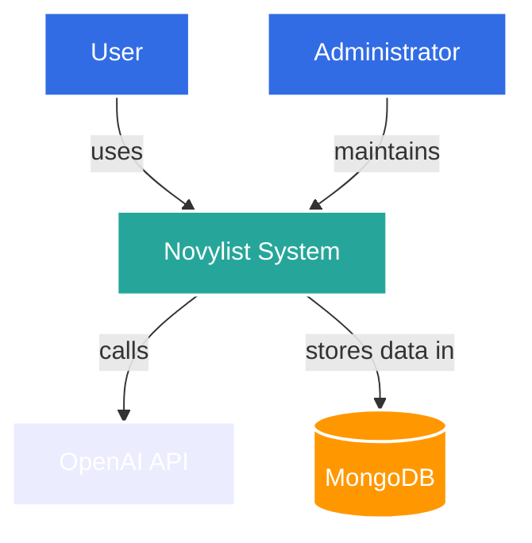

# Architecture Diagrams

This directory contains architecture diagrams for Novylist using the C4 model approach.

## C4 Model Overview

The C4 model is a layered approach to describing software architecture using four levels of abstraction:

1. **Context** - System context diagram showing Novylist and its relationships with users and external systems
2. **Container** - Container diagram showing the high-level technical building blocks
3. **Component** - Component diagrams showing how containers are composed of components
4. **Code** - Code level diagrams (optional, as this can be generated from the code)

## Diagram Standards

All diagrams will follow these standards:

- Created using a diagramming tool that supports version control (e.g., PlantUML, Mermaid)
- Stored in both source format and as rendered images
- Named consistently: `[level]-[subject]-[optional detail].{md|png|svg}`
- Include a title, description, and last updated date
- Use consistent color coding:
  - Blue: User/Person
  - Gray: External System
  - Green: Container/Component within Novylist
  - Yellow: Database
  - Purple: AI Services

## Directory Structure

- `/context` - System context diagrams
- `/container` - Container diagrams
- `/component` - Component diagrams
- `/sequence` - Sequence diagrams for key flows
- `/deployment` - Deployment diagrams

## Creating Diagrams

For new diagrams, follow these steps:

1. Create a Markdown file with embedded diagram code
2. Use consistent styling and color coding
3. Generate rendered image (PNG/SVG)
4. Update this README if adding new diagram types

## Example Diagram (Mermaid)

## Diagram Review Process

All architecture diagrams should be:

1. Created according to the standards above
2. Reviewed by the team for accuracy and clarity
3. Updated whenever the architecture changes
4. Referenced in relevant documentation

## Current Diagrams

_(This section will be updated as diagrams are created)_

- System Context
  - `context-system-overview.md` - Overall system context

- Container Level
  - `container-overall-architecture.md` - Main containers in the system

- Component Level
  - `component-ai-integration.md` - AI integration components
  - `component-editor-integration.md` - Quill editor integration

- Sequence Diagrams
  - `sequence-ai-assistance-flow.md` - AI writing assistance flow
  - `sequence-authentication-flow.md` - User authentication flow

- Deployment Diagrams
  - `deployment-production.md` - Production deployment architecture
