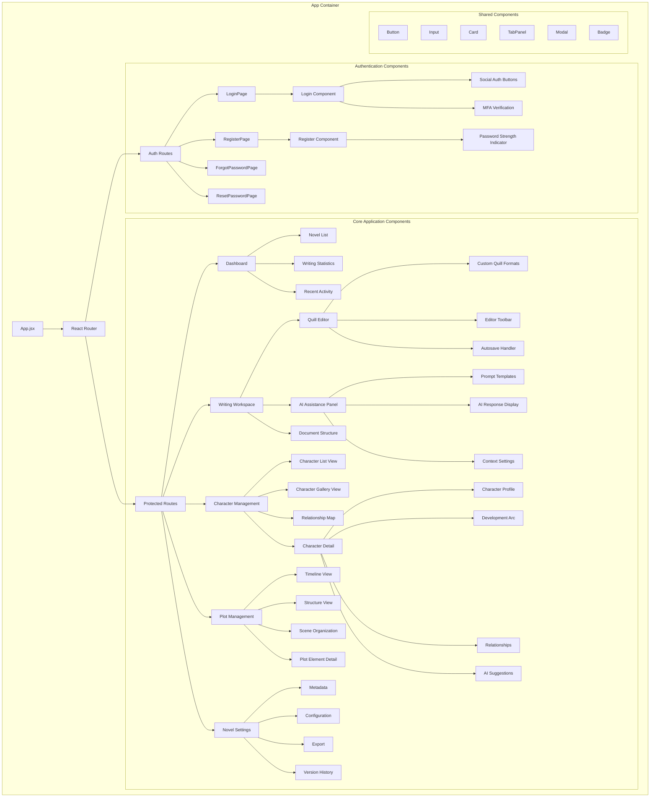
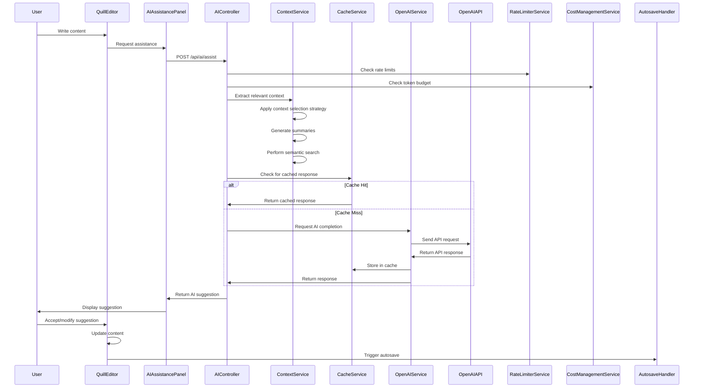
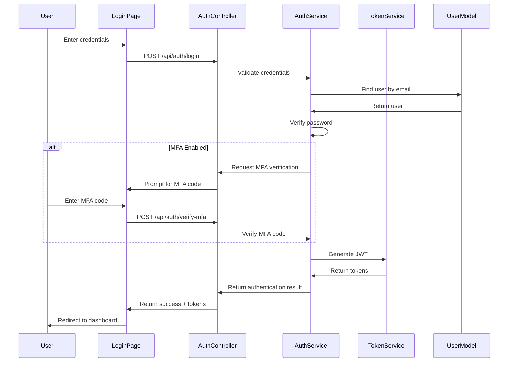

# Novylist Component Architecture

## Overview

This document provides a detailed view of the component-level architecture for Novylist, showing the internal structure of key containers and their interactions. The component diagrams are organized by major system areas, including frontend React components and backend services.

## Frontend Component Architecture

### React Component Hierarchy



### Component Responsibilities

#### Core Application Components

**WritingWorkspace**
- Manages the overall writing interface, including editor, AI assistance panel, and document structure
- Handles state management for the current document being edited
- Coordinates interactions between editing and AI assistance

**QuillEditor**
- Wraps Quill.js with novel-specific functionality
- Manages editor state, formatting, and content persistence
- Implements custom formats for novel elements (chapters, scenes, etc.)
- Provides word counting, autosave, and other novel writing utilities

**AIAssistancePanel**
- Displays AI-generated suggestions and completions
- Manages prompt templates and user input for AI requests
- Handles context selection and visualization
- Provides controls for AI assistance settings

**CharacterManagement**
- Provides multiple views for character exploration and management
- Manages character creation, editing, and relationships
- Coordinates with AI services for character development suggestions

**PlotManagement**
- Provides timeline and structure visualization of plot elements
- Manages scene organization and narrative progression
- Coordinates with AI services for plot development assistance

**NovelSettings**
- Manages novel metadata, configuration, and preferences
- Handles export configuration and format selection
- Provides version history visualization and management

#### Authentication Components

**Login/Register**
- Handle user authentication flows
- Manage form validation and error handling
- Integrate with social authentication providers
- Support multi-factor authentication

#### Shared Components

**Button, Input, Card, etc.**
- Provide consistent UI elements across the application
- Implement accessibility features and responsive behavior
- Support theming and style variations

## Backend Component Architecture

```mermaid
graph TD
    subgraph "API Layer"
        ExpressApp[Express App] --> AuthRoutes[Auth Routes]
        ExpressApp --> NovelRoutes[Novel Routes]
        ExpressApp --> AIRoutes[AI Routes]
        ExpressApp --> UserRoutes[User Routes]
        
        AuthRoutes --> AuthController[Auth Controller]
        NovelRoutes --> NovelController[Novel Controller]
        AIRoutes --> AIController[AI Controller]
        UserRoutes --> UserController[User Controller]
    end
    
    subgraph "Service Layer"
        AuthController --> AuthService[Auth Service]
        AuthController --> EmailService[Email Service]
        AuthController --> TokenService[Token Service]
        
        NovelController --> NovelService[Novel Service]
        NovelController --> VersionService[Version Service]
        
        AIController --> OpenAIService[OpenAI Service]
        AIController --> ContextService[Context Service]
        AIController --> CacheService[Cache Service]
        AIController --> RateLimiterService[Rate Limiter Service]
        AIController --> CostManagementService[Cost Management Service]
        
        UserController --> UserService[User Service]
    end
    
    subgraph "Data Layer"
        AuthService --> UserModel[User Model]
        UserService --> UserModel
        
        NovelService --> NovelModel[Novel Model]
        NovelService --> ChapterModel[Chapter Model]
        NovelService --> SceneModel[Scene Model]
        NovelService --> BeatModel[Beat Model]
        
        VersionService --> VersionModel[Version Model]
        
        NovelService --> CharacterModel[Character Model]
        NovelService --> RelationshipModel[Relationship Model]
        NovelService --> PlotElementModel[PlotElement Model]
        NovelService --> CommentModel[Comment Model]
        
        CacheService --> RedisClient[Redis Client]
        RateLimiterService --> RedisClient
    end
    
    subgraph "External Services"
        OpenAIService --> OpenAIAPI[OpenAI API]
        EmailService --> EmailProvider[Email Provider]
        AuthService --> OAuthProviders[OAuth Providers]
    end
```



### Component Responsibilities

#### API Layer

**ExpressApp**
- Main application entry point
- Configures middleware and routes
- Manages error handling and request processing

**Auth/Novel/AI/User Routes**
- Define API endpoints and HTTP methods
- Validate request parameters
- Forward requests to appropriate controllers

#### Service Layer

**AuthService**
- Handles user authentication and authorization
- Manages password hashing and verification
- Integrates with OAuth providers
- Implements MFA functionality

**NovelService**
- Manages novel content and metadata
- Handles narrative structure (chapters, scenes, beats)
- Coordinates with version service for history tracking

**OpenAIService**
- Provides interface to OpenAI API
- Handles request/response formatting
- Manages API key and authentication

**ContextService**
- Implements context handling strategies for novel-length content
- Manages context window, summarization, and semantic search
- Optimizes token usage for effective context

**CacheService**
- Provides caching mechanisms for API responses and embeddings
- Implements LRU eviction and persistence strategies
- Tracks cache statistics and hit rates

**RateLimiterService**
- Enforces usage limits based on subscription tiers
- Tracks API call counts and token usage
- Provides rate limit status and reset information

**CostManagementService**
- Estimates and tracks API usage costs
- Manages token budgets for different features
- Provides usage reporting and analytics

#### Data Layer

**Models (User, Novel, Chapter, etc.)**
- Define data schemas and validation
- Implement model-specific middleware and methods
- Manage relationships between entities
- Provide indexing for efficient queries

## Component Interactions for Key Features

### AI-Assisted Writing Flow



### Authentication Flow



## State Management Architecture

### Redux Store Structure

```mermaid
graph TD
    subgraph "Redux Store"
        Store[Store] --> AuthSlice[Auth Slice]
        Store --> UISlice[UI Slice]
        Store --> NovelSlice[Novel Slice]
        Store --> EditorSlice[Editor Slice]
        Store --> CharacterSlice[Character Slice]
        Store --> PlotSlice[Plot Slice]
        
        AuthSlice --> AuthState[Auth State]
        UISlice --> UIState[UI State]
        NovelSlice --> NovelState[Novel State]
        EditorSlice --> EditorState[Editor State]
        CharacterSlice --> CharacterState[Character State]
        PlotSlice --> PlotState[Plot State]
    end
    
    AuthState --> "user, isAuthenticated, loading, error"
    UIState --> "darkMode, sidebarOpen, currentModal, notifications"
    NovelState --> "novels, currentNovel, loading, error"
    EditorState --> "content, savedContent, wordCount, autosaveTimestamp"
    CharacterState --> "characters, currentCharacter, loading, error"
    PlotState --> "plotElements, timeline, structure, loading, error"
```

### Local Component State

Key components maintain local state for:
- Form inputs and validation
- UI interactions (hover, focus, expansion states)
- Temporary data before persistence
- Performance-sensitive data that doesn't need global state

### Context API Usage

React Context is used for:
- Theme provider for consistent styling
- Authentication context for route protection
- Editor configuration context
- Notification context for system messages

## Conclusion

This component architecture provides a detailed view of the internal structure of Novylist's frontend and backend systems. It shows the responsibilities of key components and their interactions, forming the foundation for implementation in Phase 2. The architecture supports the novel writing platform's core features while enabling future expansion and optimization.
