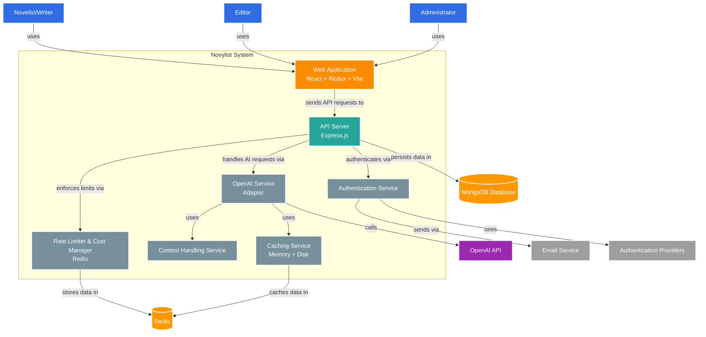

# Novylist System Container Diagram

**Title**: Novylist System Containers  
**Description**: Diagram showing the main containers (applications and data stores) that make up the Novylist system  
**Last Updated**: 4/15/2025  

This diagram illustrates the container-level view of the Novylist system, showing the major components, their responsibilities, and the interactions between them.

## Container Diagram

## Container Descriptions

### Frontend Containers

- **Web Application**: A single-page React application that provides the user interface for all Novylist functionality. It uses Redux for state management, Vite for fast development and building, and TailwindCSS for styling.
  - *Technology*: React, Redux Toolkit, Vite, TailwindCSS
  - *Responsibilities*: 
    - Provides the writing workspace with Quill editor
    - Manages character and plot development interfaces
    - Handles authentication flows
    - Communicates with backend API
    - Provides settings and configuration UIs

### Backend Containers

- **API Server**: Express.js-based REST API that handles all requests from the frontend application.
  - *Technology*: Express.js, Node.js
  - *Responsibilities*:
    - Processes user authentication and authorization
    - Handles novel, character, and plot data operations
    - Routes AI assistance requests to appropriate services
    - Manages version control for novels
    - Implements collaboration features

### Services

- **Authentication Service**: Handles user authentication, registration, and account management.
  - *Technology*: Passport.js, JWT
  - *Responsibilities*:
    - Manages user registration and login
    - Issues and validates JWT tokens
    - Integrates with OAuth providers
    - Handles password reset and account recovery
    - Implements multi-factor authentication

- **Rate Limiter & Cost Manager**: Controls API usage and costs for AI features.
  - *Technology*: Redis, Custom middleware
  - *Responsibilities*:
    - Enforces rate limits based on subscription tier
    - Tracks token usage and costs
    - Manages budget allocations
    - Provides usage statistics
    - Handles overage scenarios

- **OpenAI Service**: Adapter for interacting with OpenAI's API.
  - *Technology*: Node.js, OpenAI SDK
  - *Responsibilities*:
    - Handles API requests to OpenAI
    - Selects appropriate model based on user tier
    - Formats prompts for different AI features
    - Processes and transforms API responses
    - Implements error handling and retries

- **Context Handling Service**: Manages context for novel-length content.
  - *Technology*: Custom Node.js service
  - *Responsibilities*:
    - Implements text segmentation strategies
    - Manages context window with different strategies
    - Creates multi-level summarization
    - Performs semantic similarity search
    - Builds intelligent prompt construction

- **Caching Service**: Provides multi-level caching for performance optimization.
  - *Technology*: Redis, Node.js file system
  - *Responsibilities*:
    - Implements memory caching with LRU eviction
    - Manages persistent disk caching
    - Handles exact match and context-aware caching
    - Provides cache statistics
    - Implements cache invalidation strategies

### Data Stores

- **MongoDB Database**: Primary data store for all Novylist content.
  - *Technology*: MongoDB
  - *Responsibilities*:
    - Stores user accounts and authentication data
    - Manages novel content with hierarchical structure
    - Handles character and plot element data
    - Stores version history and branches
    - Manages collaboration permissions

- **Redis**: In-memory data store for caching, rate limiting, and temporary data.
  - *Technology*: Redis
  - *Responsibilities*:
    - Stores rate limiting counters
    - Caches API responses and embeddings
    - Maintains session data
    - Stores temporary processing results
    - Manages scheduled jobs

### External Systems

- **OpenAI API**: External AI service provider.
  - *Responsibilities*:
    - Provides text completion capabilities
    - Generates embeddings for semantic search
    - Offers models with different capabilities and costs

- **Email Service**: External service for sending emails.
  - *Responsibilities*:
    - Sends verification emails
    - Delivers password reset links
    - Provides notification emails
    - Handles collaboration invitations

- **Authentication Providers**: External OAuth providers.
  - *Examples*: Google, LinkedIn
  - *Responsibilities*:
    - Provide social authentication options
    - Verify user identities
    - Share authorized user profile information

## Key Interactions

### User Authentication Flow

1. User submits login credentials to Web Application
2. Web Application sends credentials to API Server
3. API Server routes to Authentication Service
4. Authentication Service validates credentials, possibly checking with Authentication Providers
5. JWT token generated and returned to user

### AI-Assisted Writing Flow

1. Writer enters content in the Web Application's editor
2. Web Application sends writing continuation request to API Server
3. API Server checks authentication and permissions
4. Request passes through Rate Limiter & Cost Manager to check limits
5. OpenAI Service receives the request
6. Context Handling Service processes the novel content
7. Caching Service checks for cached similar requests
8. If not cached, request is sent to OpenAI API
9. Response is processed, cached, and returned to user

### Novel Data Management Flow

1. User creates or edits novel content in Web Application
2. Changes are sent to API Server
3. API Server validates and processes the request
4. Data is stored in MongoDB Database
5. Version control information is updated
6. Confirmation is returned to user

## Technology Choices and Constraints

- **React + Redux + Vite**: Chosen for frontend to enable rich, responsive UI with efficient state management
- **Express.js**: Selected for backend due to its flexibility and ecosystem
- **MongoDB**: Chosen for its document-based structure that fits narrative content well
- **Redis**: Used for performance-critical operations requiring fast in-memory access
- **JWT**: Implemented for stateless, scalable authentication
- **OpenAI GPT Models**: Selected for AI assistance with tiered approach based on subscription level

## Performance Considerations

- Caching at multiple levels significantly reduces latency (seconds to milliseconds)
- Context handling strategies balance comprehensive context with token limitations
- Redis used for performance-critical operations requiring millisecond response times
- Token budget allocation optimizes context relevance within limitations
- Tiered model approach balances quality and cost considerations

## Security Considerations

- API requests secured with JWT authentication
- Rate limiting prevents abuse and DOS attacks
- Sensitive operations require additional verification
- External API credentials securely managed
- User novel content secured with appropriate access controls

## Notes and Future Enhancements

- Container architecture allows for independent scaling of components
- Services are designed to be replaceable (e.g., different AI providers)
- Caching strategy significantly reduces operational costs and improves performance
- Future enhancement: Streaming responses for better user experience
- Future enhancement: Fine-tuned embeddings for improved semantic search
