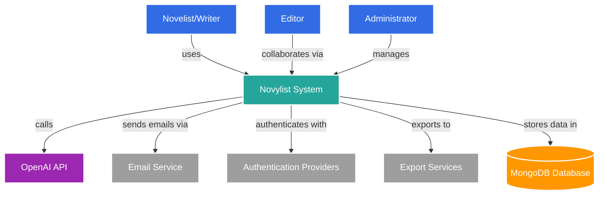

# Novylist System Context Diagram

**Title**: Novylist System Context  
**Description**: High-level view of Novylist and its interactions with users and external systems  
**Last Updated**: 4/13/2025  

This diagram shows the Novylist system in context, illustrating how different users interact with the system and how Novylist connects with external systems.

## System Context Diagram

## Element Descriptions

### Users
- **Novelist/Writer**: Primary user who creates and manages novels, chapters, characters, and plots
- **Editor**: Collaborator who reviews and provides feedback on the writer's work
- **Administrator**: System administrator who manages the platform and user accounts

### Novylist System
- Core application providing novel writing, management, and AI assistance capabilities

### External Systems
- **OpenAI API**: Provides AI capabilities for writing assistance, character development, and plot analysis
- **Email Service**: External service for sending verification emails, password resets, and notifications
- **Authentication Providers**: OAuth providers like Google and LinkedIn for social authentication
- **Export Services**: Services for exporting novels to different formats (PDF, EPUB, etc.)

### Data Store
- **MongoDB Database**: Primary data store for all Novylist content, user data, and system configurations

## Key Interactions

1. Writers use Novylist to create and manage their novels, utilizing AI assistance
2. Editors collaborate with writers through Novylist's sharing and feedback features
3. Novylist leverages OpenAI API for intelligent writing assistance
4. The system stores all data in MongoDB
5. Authentication can be handled directly or via third-party providers
6. Email services facilitate communication and account management
7. Export services allow users to output their work in various formats

## Notes and Constraints

- OpenAI API integration is crucial for the AI-powered writing assistance features
- The system requires reliable database performance for handling large novel documents
- Authentication security is a priority, requiring robust implementation
- The system needs to handle various user roles and permission levels
