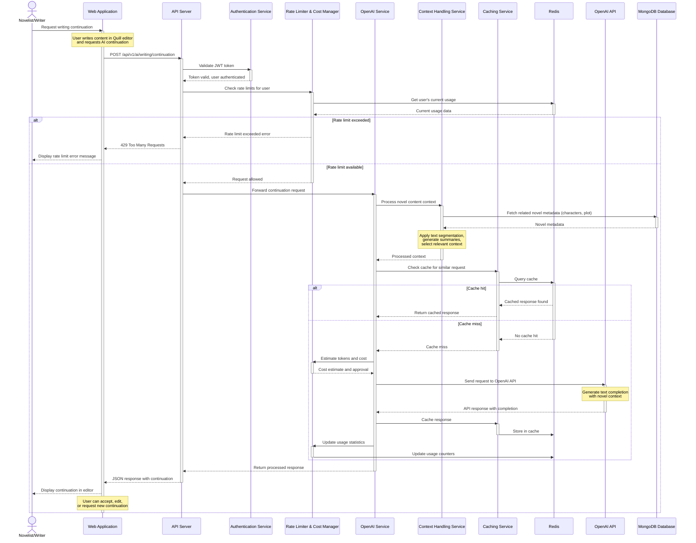

# AI-Assisted Writing Flow Sequence Diagram

**Title**: AI-Assisted Writing Flow  
**Description**: Sequence diagram illustrating the interactions between components during an AI-assisted writing request  
**Last Updated**: 4/15/2025  

This diagram illustrates the sequence of interactions that occur when a user requests AI-assisted writing continuation from the Novylist system.

## Sequence Diagram

## Flow Description

### 1. Request Initiation
The flow begins when a novelist or writer requests a writing continuation from the Novylist web application. This typically happens after the user has written some content and wants AI assistance to continue their narrative.

### 2. Authentication and Validation
- The Web Application sends a POST request to the API Server
- The API Server validates the user's JWT token using the Authentication Service
- If authentication fails, the flow stops with an appropriate error

### 3. Rate Limiting Check
- The API Server checks with the Rate Limiter & Cost Manager to determine if the user has available quota
- Rate Limiter checks Redis to get the user's current usage statistics
- If the user has exceeded their rate limit, an error is returned
- Otherwise, the request is allowed to proceed

### 4. Context Processing
- The OpenAI Service forwards the request to the Context Handling Service
- Context Handling Service fetches relevant metadata from the MongoDB Database (characters, plot elements)
- The service then processes the novel content using:
  - Text segmentation to break content into manageable chunks
  - Summarization for distant context
  - Selection of most relevant content based on token budget

### 5. Cache Check
- The OpenAI Service checks with the Caching Service to see if a similar request exists in the cache
- Caching Service queries Redis to look for a cache hit
- If a cached response is found, it's returned immediately (➡ Step 8)
- If no cache hit, the flow continues to the OpenAI API call

### 6. Token and Cost Management
- Before making an API call, the system estimates tokens and cost
- The Rate Limiter & Cost Manager approves the request if the user has sufficient budget

### 7. OpenAI API Interaction
- The OpenAI Service sends the processed context and prompt to the OpenAI API
- OpenAI API generates a completion based on the prompt
- The response is returned to the OpenAI Service

### 8. Response Processing
- If this was a new response (not from cache), it's stored in the cache
- Usage statistics are updated in Redis
- The response is processed and returned to the API Server
- The API Server formats and returns the JSON response to the Web Application
- The Web Application displays the continuation in the editor for the user

### 9. User Interaction with Result
- The user can accept the continuation as is
- Edit the continuation to match their preferences
- Request a new continuation with updated context

## Error Handling and Edge Cases

### Rate Limit Exceeded
If the user has exceeded their daily request limit:
1. The Rate Limiter returns a rate limit exceeded error
2. The API Server returns a 429 Too Many Requests response
3. The Web Application displays an appropriate error message to the user
4. The user may be shown their usage statistics and when the limit will reset

### Token Budget Exceeded
If the request would exceed the user's token budget:
1. The Rate Limiter & Cost Manager returns a budget exceeded error
2. The API Server returns a 403 Forbidden response
3. The Web Application displays an error message explaining the token budget limitations
4. The user may be offered options to upgrade their subscription tier

### OpenAI API Failure
If the OpenAI API call fails:
1. The OpenAI Service implements retry logic with exponential backoff
2. If retries fail, an appropriate error is returned
3. The Web Application displays an error message to the user
4. Failure details are logged for administrator review

## Performance Optimization

This flow includes several performance optimizations:
1. **Caching**: Similar requests are cached to avoid redundant API calls
2. **Context Selection**: Only the most relevant context is sent to save tokens and improve response quality
3. **Tiered Model Selection**: Different models are used based on the user's subscription tier
4. **Token Budget Allocation**: Token usage is carefully managed to maximize relevance within token limits

## Security Considerations

1. All API requests require valid JWT authentication
2. Rate limiting prevents abuse and denial of service
3. User novel content is kept secure and not stored by OpenAI beyond the request
4. API credentials are securely managed
5. Usage statistics are tracked to prevent unauthorized use

## Implementation Notes

- This flow balances performance, cost, and quality considerations
- The caching strategy significantly improves response times for similar requests
- Context handling is the most complex part of the flow, requiring careful token management
- The system is designed to handle very long novels through intelligent context selection
- Frontend has appropriate handling for loading states and errors during this process
