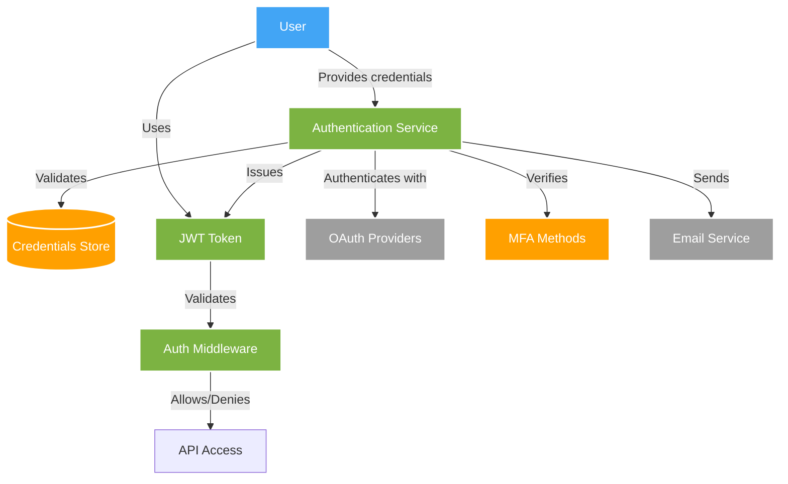
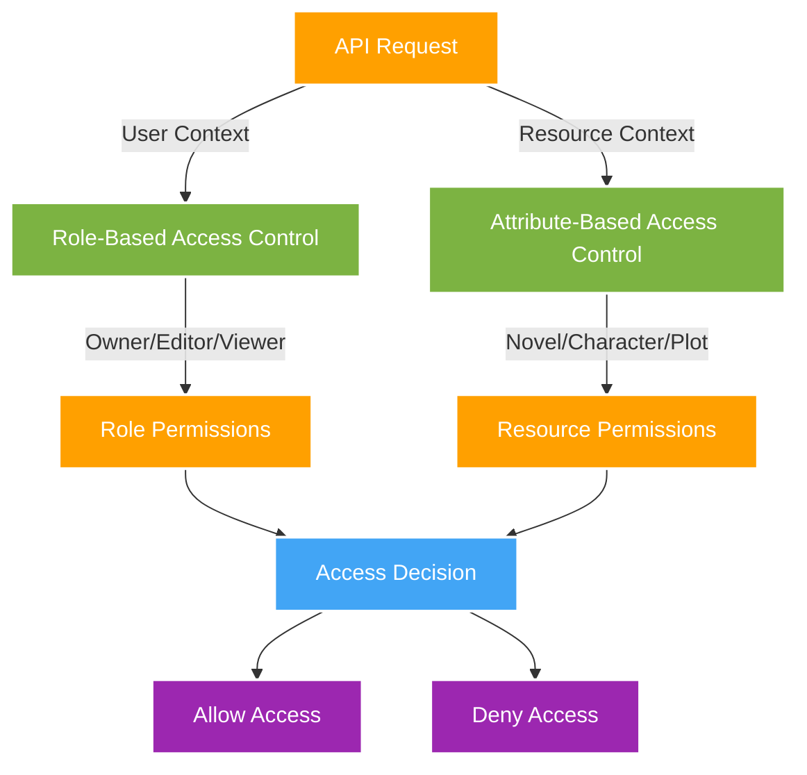
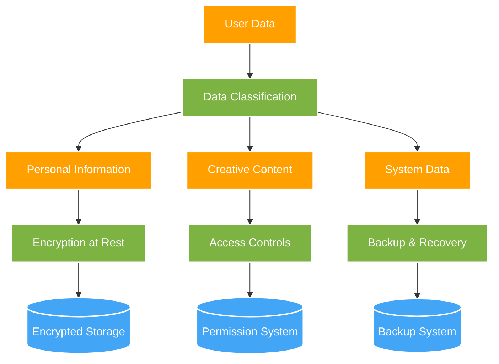
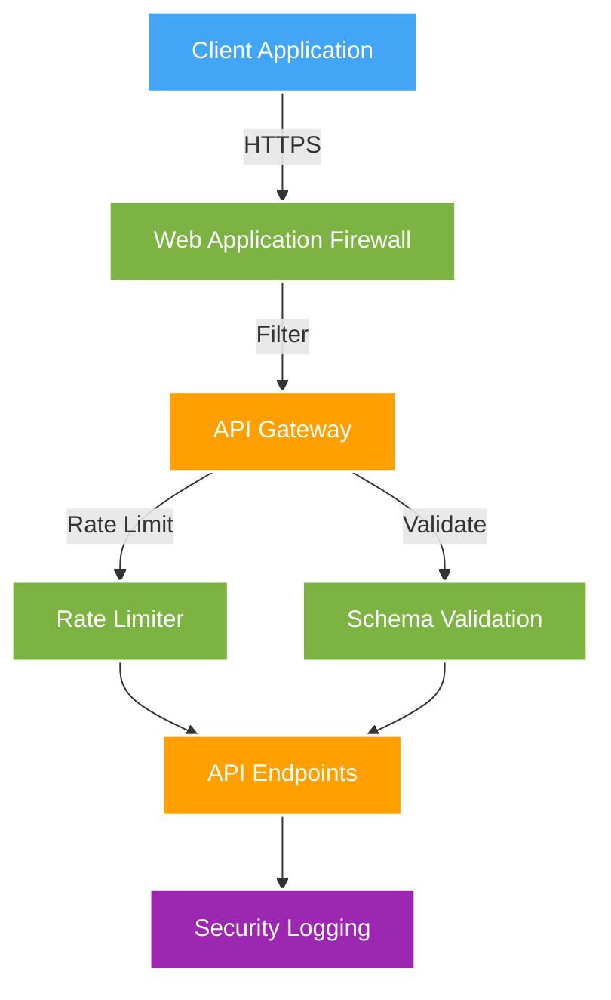
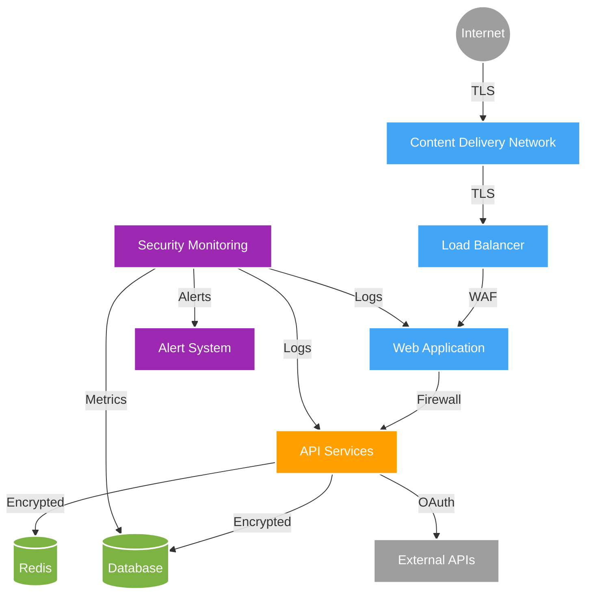
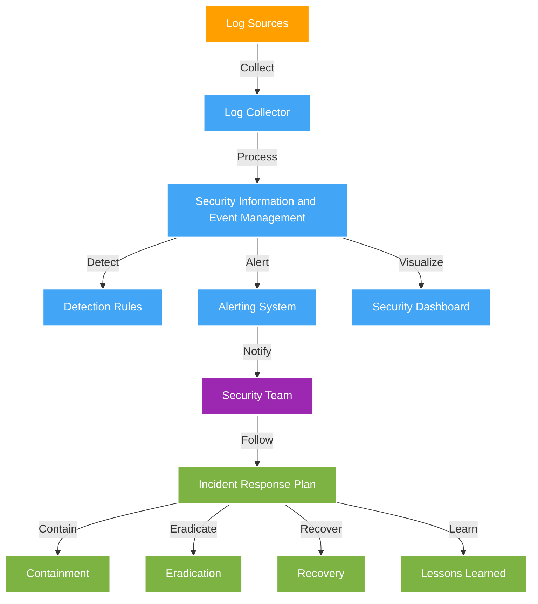
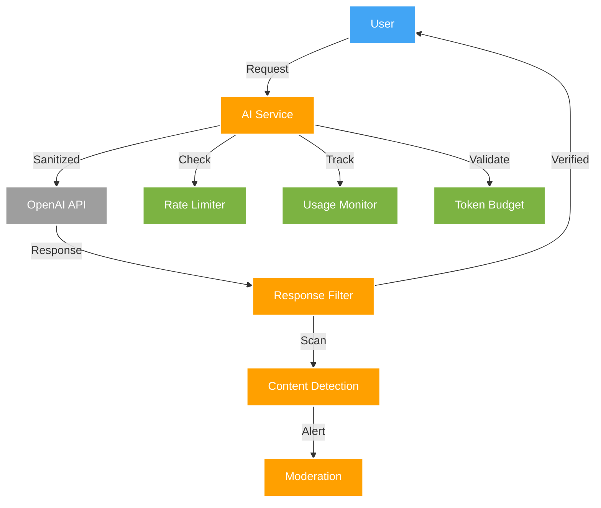

# Security Architecture

**Title**: Novylist Security Architecture  
**Description**: Comprehensive documentation of the security architecture for Novylist  
**Last Updated**: 4/15/2025  

This document outlines the security architecture, practices, and measures implemented in the Novylist system to protect user data, content, and the platform itself.

## Overview

The Novylist security architecture is designed with a defense-in-depth approach, implementing multiple layers of security controls to protect user content, personal information, and system integrity. The security architecture addresses:

1. Authentication and authorization
2. Data protection and privacy
3. API security
4. Infrastructure security
5. Monitoring and incident response

## Security Principles

The security architecture is based on the following core principles:

- **Least Privilege**: Users and system components have only the permissions necessary to perform their functions.
- **Defense in Depth**: Multiple security controls work together to provide comprehensive protection.
- **Data Minimization**: Only necessary data is collected and stored, reducing the risk surface.
- **Secure by Default**: Security is built into the system architecture from the beginning.
- **Regular Security Testing**: Continuous security assessment to identify and address vulnerabilities.
- **Privacy by Design**: User privacy is prioritized in all design decisions.

## Authentication Architecture



### User Authentication

1. **Multi-factor Authentication**
   - Support for app-based, email, and SMS verification
   - Configurable MFA requirements based on security needs
   - Risk-based authentication triggers additional verification

2. **Password Security**
   - Bcrypt hashing with appropriate work factor
   - Password complexity requirements (8+ chars, letters, numbers, special chars)
   - Account lockout after failed attempts with exponential backoff
   - Password reset with secure tokens and expiration

3. **JWT-based Sessions**
   - Short-lived access tokens (15 minutes)
   - Longer-lived refresh tokens (7 days) with secure storage
   - Token rotation on each refresh
   - Token revocation on logout or security events

4. **OAuth Integration**
   - Support for Google and LinkedIn authentication
   - Limited permission scope requests
   - Account linking with existing accounts
   - Validation of OAuth provider responses

### Example JWT Implementation

```javascript
// JWT Generation
function generateTokens(user) {
  const accessToken = jwt.sign(
    { userId: user._id, role: user.role },
    process.env.JWT_ACCESS_SECRET,
    { expiresIn: '15m' }
  );
  
  const refreshToken = jwt.sign(
    { userId: user._id, tokenVersion: user.tokenVersion },
    process.env.JWT_REFRESH_SECRET,
    { expiresIn: '7d' }
  );
  
  return { accessToken, refreshToken };
}

// JWT Validation Middleware
function authenticateJWT(req, res, next) {
  const authHeader = req.headers.authorization;
  
  if (!authHeader) {
    return res.status(401).json({ error: 'Authorization header missing' });
  }
  
  const token = authHeader.split(' ')[1];
  
  try {
    const decoded = jwt.verify(token, process.env.JWT_ACCESS_SECRET);
    req.user = decoded;
    next();
  } catch (err) {
    return res.status(403).json({ error: 'Invalid or expired token' });
  }
}
```

## Authorization Architecture



### Authorization Controls

1. **Role-Based Access Control**
   - Predefined roles: Owner, Editor, Viewer
   - Fine-grained permission sets for each role
   - Role inheritance for hierarchical permissions

2. **Attribute-Based Access Control**
   - Dynamic permissions based on resource attributes
   - Support for time-based access restrictions
   - Contextual permissions for collaborative features

3. **Collaboration Security**
   - Document-level access controls for shared novels
   - Audit logs for collaborative actions
   - Approval workflows for sensitive changes

### Example Authorization Implementation

```javascript
// Permission check middleware
async function checkPermission(req, res, next) {
  const { user } = req;
  const { novelId } = req.params;
  
  try {
    const novel = await Novel.findById(novelId);
    
    if (!novel) {
      return res.status(404).json({ error: 'Novel not found' });
    }
    
    // Check if user has access to this novel
    const collaborator = novel.collaborators.find(
      c => c.userId.toString() === user.userId
    );
    
    if (!collaborator && novel.owner.toString() !== user.userId) {
      return res.status(403).json({ error: 'Access denied' });
    }
    
    // For owners, grant all permissions
    if (novel.owner.toString() === user.userId) {
      req.permissions = { 
        read: true, 
        edit: true, 
        delete: true, 
        share: true 
      };
      return next();
    }
    
    // For collaborators, check role permissions
    req.permissions = {
      read: true, // All collaborators can read
      edit: collaborator.role === 'editor',
      delete: false, // Only owners can delete
      share: collaborator.permissions.share
    };
    
    next();
  } catch (err) {
    return res.status(500).json({ error: 'Server error' });
  }
}
```

## Data Protection



### Data Classification

| Data Type | Examples | Protection Level | Retention |
|-----------|----------|------------------|-----------|
| PII | Email, Name, Payment Info | High | As long as account active + 30 days |
| Authentication | Password hashes, MFA secrets | High | As long as account active |
| Creative Content | Novels, Characters, Plot | Medium | Until user deletion |
| Usage Data | Feature usage, AI interactions | Low | 90 days for detailed, 1 year aggregated |
| System Logs | API access, Error logs | Medium | 30 days detailed, 1 year aggregated |

### Data Protection Controls

1. **Encryption**
   - Data at rest: AES-256 encryption for databases
   - Data in transit: TLS 1.3 for all communications
   - Key management through AWS KMS or similar system
   - Database field-level encryption for sensitive data

2. **Data Isolation**
   - Strict separation between user accounts
   - Multi-tenant architecture with logical isolation
   - Separate storage for sensitive information

3. **Data Minimization**
   - Collection of only necessary data
   - Automated removal of unnecessary data
   - Anonymization of data used for analytics

### Example Data Protection Implementation

```javascript
// Database field encryption
const userSchema = new mongoose.Schema({
  email: {
    type: String,
    required: true,
    unique: true
  },
  password: {
    type: String,
    required: true
  },
  firstName: {
    type: String,
    encrypted: true
  },
  lastName: {
    type: String,
    encrypted: true
  },
  // Payment information with field-level encryption
  paymentInfo: {
    cardLastFour: {
      type: String,
      encrypted: true
    },
    // Only store tokenized payment info
    paymentToken: {
      type: String,
      encrypted: true
    },
    expiryDate: {
      type: String,
      encrypted: true
    }
  }
});

// Pre-save hook for password hashing
userSchema.pre('save', async function(next) {
  if (this.isModified('password')) {
    this.password = await bcrypt.hash(this.password, 12);
  }
  next();
});
```

## API Security



### API Security Controls

1. **Request Validation**
   - Strong input validation on all API endpoints
   - Schema validation for request parameters
   - Content type validation and sanitization
   - Prevention of parameter pollution

2. **Rate Limiting**
   - Per-user rate limits for all endpoints
   - Tiered rate limiting based on subscription
   - More restrictive limits for authentication endpoints
   - Graduated response (warning, temporary block, long-term block)

3. **API Gateway Security**
   - Request filtering and normalization
   - Response headers security configuration
   - API versioning to manage changes
   - Audit logging of API access

### Example API Security Implementation

```javascript
// Input validation middleware using Joi
function validateResource(resourceSchema) {
  return (req, res, next) => {
    const { error } = resourceSchema.validate(req.body);
    
    if (error) {
      return res.status(400).json({ 
        error: error.details.map(detail => detail.message).join(', ') 
      });
    }
    
    next();
  };
}

// Rate limiting middleware
const apiLimiter = rateLimit({
  windowMs: 15 * 60 * 1000, // 15 minutes
  max: async (req, res) => {
    const user = req.user;
    
    // If user is authenticated, apply user-specific limits
    if (user) {
      const limits = {
        free: 100,
        standard: 300,
        premium: 1000
      };
      
      return limits[user.subscription.tier] || 50;
    }
    
    // Default limit for unauthenticated requests
    return 30;
  },
  standardHeaders: true,
  legacyHeaders: false,
  skipSuccessfulRequests: false,
  keyGenerator: (req) => {
    return req.user ? req.user.userId : req.ip;
  }
});
```

## Infrastructure Security



### Infrastructure Security Controls

1. **Network Security**
   - Defense in depth with multiple security layers
   - Network segmentation for isolation of components
   - Web Application Firewall for request filtering
   - TLS 1.3 for all connections with strong cipher suites

2. **Container Security**
   - Minimal container images with necessary components only
   - Regular security scanning of container images
   - Immutable infrastructure with regular rebuilds
   - Runtime security monitoring

3. **Secrets Management**
   - Centralized secrets management
   - Rotation of credentials and certificates
   - Just-in-time access for administrative functions
   - Principle of least privilege for service accounts

### Example Infrastructure Security Configurations

```yaml
# NGINX security configuration
server {
    listen 443 ssl http2;
    server_name api.novylist.com;
    
    # Strong SSL configuration
    ssl_certificate /etc/ssl/certs/novylist.crt;
    ssl_certificate_key /etc/ssl/private/novylist.key;
    ssl_protocols TLSv1.2 TLSv1.3;
    ssl_prefer_server_ciphers on;
    ssl_ciphers 'ECDHE-ECDSA-AES256-GCM-SHA384:ECDHE-RSA-AES256-GCM-SHA384';
    ssl_session_timeout 1d;
    ssl_session_cache shared:SSL:10m;
    ssl_session_tickets off;
    
    # HSTS - ensure client always uses HTTPS
    add_header Strict-Transport-Security "max-age=63072000; includeSubDomains; preload";
    
    # Security headers
    add_header X-Content-Type-Options nosniff;
    add_header X-Frame-Options DENY;
    add_header X-XSS-Protection "1; mode=block";
    add_header Content-Security-Policy "default-src 'self'; script-src 'self'; img-src 'self' data:; style-src 'self' 'unsafe-inline'; font-src 'self'; connect-src 'self' api.novylist.com;";
    
    # Proxy to application server
    location / {
        proxy_pass http://app:3000;
        proxy_set_header Host $host;
        proxy_set_header X-Real-IP $remote_addr;
        proxy_set_header X-Forwarded-For $proxy_add_x_forwarded_for;
        proxy_set_header X-Forwarded-Proto $scheme;
    }
}
```

## Security Monitoring and Incident Response



### Security Monitoring

1. **Log Collection and Analysis**
   - Centralized logging solution for all system components
   - Correlation of events across different services
   - Retention of security-relevant logs for at least 90 days
   - Regular log reviews and automated alerting

2. **Security Information and Event Management (SIEM)**
   - Real-time monitoring of security events
   - Anomaly detection for unusual patterns
   - Integration with threat intelligence feeds
   - Automated alerting for critical security events

3. **Vulnerability Management**
   - Regular automated vulnerability scanning
   - Dependency tracking and updates
   - Prioritization based on risk assessment
   - Remediation tracking and verification

### Incident Response

1. **Incident Response Plan**
   - Clearly defined roles and responsibilities
   - Communication procedures and escalation paths
   - Containment, eradication, and recovery procedures
   - Post-incident analysis and improvement

2. **Security Response Team**
   - Cross-functional team with defined roles
   - Regular training and tabletop exercises
   - On-call rotation for immediate response
   - Access to necessary tools and resources

### Example Security Monitoring Implementation

```javascript
// API request logging middleware
function securityLoggingMiddleware(req, res, next) {
  // Capture original end function
  const originalEnd = res.end;
  
  // Get request start time
  const startTime = Date.now();
  
  // Override end function
  res.end = function(chunk, encoding) {
    // Calculate response time
    const responseTime = Date.now() - startTime;
    
    // Restore original end function
    res.end = originalEnd;
    
    // Call original end function
    res.end(chunk, encoding);
    
    // Log security relevant information
    const logData = {
      timestamp: new Date().toISOString(),
      method: req.method,
      url: req.originalUrl,
      statusCode: res.statusCode,
      responseTime,
      userAgent: req.headers['user-agent'],
      ipAddress: req.ip,
      userId: req.user ? req.user.userId : 'unauthenticated',
      requestId: req.headers['x-request-id'] || uuidv4()
    };
    
    // Add suspicious activity flags
    if (res.statusCode === 401 || res.statusCode === 403) {
      logData.securityEvent = 'AUTH_FAILURE';
      logData.severity = 'WARNING';
    }
    
    // Log to security logging system
    securityLogger.log(logData);
  };
  
  next();
}
```

## AI-Specific Security Considerations



### AI Security Controls

1. **Prompt Security**
   - Sanitization of inputs before sending to AI models
   - Prevention of prompt injection attacks
   - Context window management to prevent data leakage
   - Monitoring for adversarial prompts

2. **Output Filtering**
   - Content moderation for AI-generated responses
   - Filtering of potentially harmful or inappropriate content
   - Verification of generated content against security rules
   - Fallback mechanisms for rejected content

3. **Resource Protection**
   - Rate limiting of AI requests
   - Usage monitoring and anomaly detection
   - Cost controls and budget enforcement
   - Token limitations to prevent abuse

### Example AI Security Implementation

```javascript
// AI content security filter
async function aiContentSecurityFilter(prompt, response) {
  // Check for sensitive information in the response
  const sensitivePatterns = [
    /\b(?:\d[ -]*?){13,16}\b/, // Credit card numbers
    /\b[A-Za-z0-9._%+-]+@[A-Za-z0-9.-]+\.[A-Za-z]{2,}\b/, // Email addresses
    /\b(?:\+\d{1,2}\s)?\(?\d{3}\)?[\s.-]?\d{3}[\s.-]?\d{4}\b/ // Phone numbers
  ];
  
  // Check if response contains sensitive information
  const hasSensitiveInfo = sensitivePatterns.some(pattern => 
    pattern.test(response)
  );
  
  if (hasSensitiveInfo) {
    logger.warn('AI response contained potentially sensitive information', {
      userId: currentUser.id,
      promptLength: prompt.length,
      responseLength: response.length
    });
    
    // Redact sensitive information
    let redactedResponse = response;
    sensitivePatterns.forEach(pattern => {
      redactedResponse = redactedResponse.replace(pattern, '[REDACTED]');
    });
    
    return redactedResponse;
  }
  
  // Check for harmful content with moderation API
  const moderationResult = await openaiService.moderateContent(response);
  
  if (moderationResult.flagged) {
    logger.warn('AI response flagged by moderation', {
      userId: currentUser.id,
      categories: moderationResult.categories,
      promptLength: prompt.length
    });
    
    return 'The AI response was flagged by our content policy. Please rephrase your request.';
  }
  
  return response;
}
```

## Compliance and Privacy

Novylist's security architecture is designed to comply with relevant regulations and standards including:

1. **Data Protection**
   - GDPR compliance for EU users
   - CCPA compliance for California users
   - Data subject access request procedures
   - Data portability and deletion capabilities

2. **Privacy Features**
   - Privacy policy with clear language
   - User consent management
   - Data collection minimization
   - Strong data retention policies

3. **Security Standards**
   - OWASP Top 10 mitigations
   - NIST Cybersecurity Framework alignment
   - SOC 2 Type II controls implementation (planned)
   - Regular third-party security assessments

## Conclusion

The Novylist security architecture implements a comprehensive, multi-layered approach to security that protects user data, content, and system integrity. By combining strong authentication, fine-grained authorization, data protection, API security, and infrastructure security with continuous monitoring, Novylist provides a secure platform for creative writing and collaboration.

Key security features include:

- JWT-based authentication with MFA support
- Role and attribute-based access controls
- Encryption for sensitive data at rest and in transit
- Rate limiting and input validation for API security
- Infrastructure security with defense in depth
- AI-specific security controls for prompt and response security
- Comprehensive security monitoring and incident response

This security architecture is continuously evaluated and improved to address emerging threats and enhance platform security.
