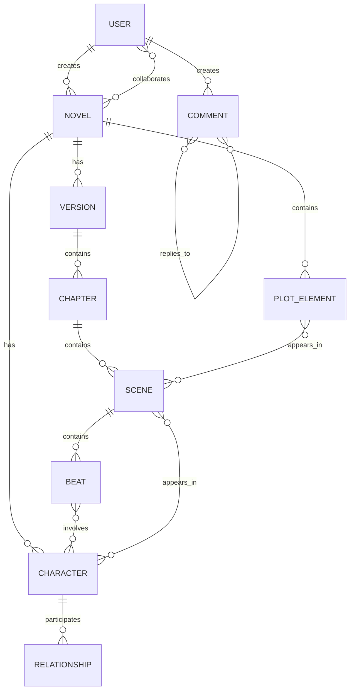

# Novylist Database Schema

This document details the database schema for Novylist, explaining the structure, relationships, and indices of all data models.

## Entity Relationship Diagram

## Models

### User Model

Stores user authentication and profile information.

**Key Fields:**
- email, username (unique identifiers)
- authProvider (local, Google, LinkedIn)
- password (hashed)
- profile (name, bio, preferences)
- settings (theme, editor preferences)
- security (MFA settings)

**Relationships:**
- One user can create many novels
- Users can collaborate on novels
- Users can create comments

**Indices:**
- email, username (unique)

### Novel Model

The top-level container for a writing project.

**Key Fields:**
- title, description
- user (owner reference)
- collaborators (array of users with roles)
- genre, status, wordCount
- settings (AI assistance level, privacy)
- currentVersion (reference to active version)
- statistics (metadata about the novel)

**Relationships:**
- Belongs to a user (creator)
- Has many versions
- Has many characters
- Has many plot elements
- Can have multiple collaborators

**Indices:**
- user, collaborators.user
- title, description (text)
- status, genre

### Version Model

Represents a specific version of the novel for tracking changes.

**Key Fields:**
- novel (reference)
- versionNumber
- name, description
- parent (for branching)
- branch information
- createdBy (user reference)

**Relationships:**
- Belongs to a novel
- Can have a parent version
- Contains many chapters

**Indices:**
- novel, versionNumber (unique)
- parent, branch.name

### Chapter Model

A major division of content within a novel version.

**Key Fields:**
- version (reference)
- title, order
- content, wordCount
- status, notes

**Relationships:**
- Belongs to a version
- Contains many scenes

**Indices:**
- version, order (unique)
- title (text)

### Scene Model

A segment of a chapter representing a distinct narrative unit.

**Key Fields:**
- chapter (reference)
- title, order
- content, wordCount
- status, purpose
- pov (character and perspective type)
- setting, timeframe
- sceneStructure (goal, conflict, etc.)
- emotionalShift (arc within scene)

**Relationships:**
- Belongs to a chapter
- Contains many beats
- Involves characters
- Can include plot elements

**Indices:**
- chapter, order (unique)

### Beat Model

The smallest narrative unit within a scene.

**Key Fields:**
- scene (reference)
- order, description
- content, beatType
- characters involved
- emotionalValue, tensionLevel
- contentPosition (for editor tracking)

**Relationships:**
- Belongs to a scene
- Involves characters

**Indices:**
- scene, order (unique)
- scene, beatType
- description (text)

### Character Model

Represents a character within the novel.

**Key Fields:**
- novel (reference)
- name, role
- description
- attributes (physical, personality, background)
- arc, goals, motivations, conflicts
- appearances (scenes where character appears)

**Relationships:**
- Belongs to a novel
- Participates in relationships
- Appears in scenes and beats
- Involved in plot elements

**Indices:**
- novel, novel+name
- name, description (text)

### Relationship Model

Represents connections between characters.

**Key Fields:**
- novel (reference)
- character1, character2 (references)
- relationshipType, strength, dynamics
- evolution (changes over time)

**Relationships:**
- Belongs to a novel
- Connects two characters

**Indices:**
- novel
- character1, character2 (unique)
- character1, character2 (individual)

### PlotElement Model

Represents plot points, events, or narrative elements.

**Key Fields:**
- novel (reference)
- title, elementType
- description
- timelinePosition (chronological location)
- structurePosition (narrative structure location)
- importance
- characters (involved with roles)
- scenes (where element appears)

**Relationships:**
- Belongs to a novel
- Involves characters
- Appears in scenes

**Indices:**
- novel
- title, description (text)
- timelinePosition.order
- structurePosition.act
- elementType

### Comment Model

Represents feedback, notes, or discussions attached to various entities.

**Key Fields:**
- content
- user (author reference)
- targetType, targetId (polymorphic reference)
- textPosition (for inline comments)
- parentComment (for threading)
- status, commentType
- isAiGenerated, tags, reactions

**Relationships:**
- Created by a user
- Can be attached to any entity type
- Can have replies (threaded comments)

**Indices:**
- targetType, targetId
- parentComment
- user, status, commentType
- content (text)
- createdAt

## Data Flow and Relationships

### Novel Creation and Structure
1. User creates a novel
2. Initial version is created
3. Chapters are added to version
4. Scenes are added to chapters
5. Beats are added to scenes

### Character and Plot Management
1. Characters are created within a novel
2. Relationships are established between characters
3. Plot elements are created and linked to scenes
4. Characters are linked to scenes and beats

### Version Control
1. New versions can branch from existing versions
2. Novel points to current active version
3. Versions maintain parent-child relationships

### Collaboration
1. Novel owner can add collaborators with different roles
2. Comments can be attached to any entity
3. Comments can form threaded discussions

## Query Patterns and Optimization

### Common Queries

1. **Get Novel with Structure**
   - Retrieve a novel with its chapters, scenes hierarchy
   - Uses multiple population levels

2. **Get Character with Appearances**
   - Find a character and all scenes where they appear
   - Uses character.appearances with population

3. **Get Scene with Context**
   - Retrieve a scene with associated beats, characters, and plot elements
   - Uses multiple population paths

4. **Search Novel Content**
   - Search across chapters, scenes, and beats
   - Uses text indices

5. **Timeline Visualization**
   - Get plot elements ordered by timeline position
   - Uses timelinePosition.order index

### Performance Considerations

1. **Document Size Management**
   - Content is stored at scene/beat level to avoid exceeding document size limits
   - References used rather than embedding for large collections

2. **Index Strategy**
   - Text indices for search functionality
   - Compound indices for common query patterns
   - Strategic single-field indices for filtering

3. **Population Depths**
   - API endpoints should limit population depth to prevent excessive joins
   - Implement field selection to retrieve only necessary data

## Implementation Notes

### Schema Evolution Strategy
As the application evolves, schema changes should follow these guidelines:
- Add new fields with default values
- Use schema versioning for major structural changes
- Create migration scripts for data transformations

### Validation Strategy
All models implement:
- Required field validation
- Enum validation for restricted values
- Custom validators for complex rules
- Pre-save middleware for timestamps

### Security Considerations
- User passwords are hashed
- Document access controlled by ownership/collaboration
- Field-level permission checks implemented in controllers

### Testing Approach
- Unit tests for model validation
- Integration tests for relationships
- Query performance testing for complex operations
